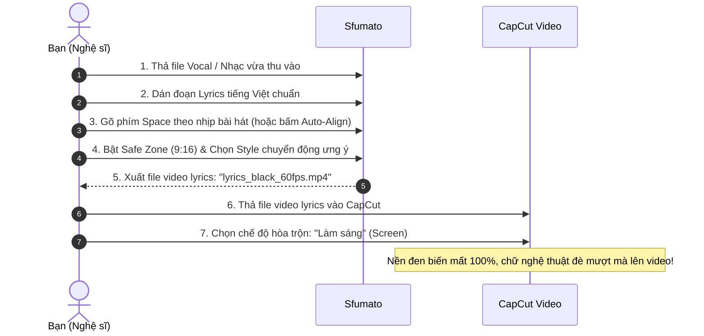

# Sfumato (スラマート)
> *"Nghệ thuật không nằm ở sự phô trương màu sắc, mà ở nhịp thở tinh tế của từng nét chữ giữa khoảng không tĩnh lặng."*

**Sfumato** là một công cụ mã nguồn mở (Open-Source Desktop / Web Tool) chuyên biệt dành cho nghệ sĩ, creator và bedroom artists: Tạo video lyrics **nền đen tuyệt đối (`#000000`)**, typography chuyển động mềm mại như nét vẽ của họa sĩ hiện đại, khớp nhịp hoàn hảo, đảm bảo 100% đúng chính tả tiếng Việt và nằm gọn trong vùng an toàn (Safe Zone) của TikTok, Reels, Shorts.

---

## 1. Triết lý Thiết kế: "The Modern Canvas"

* **Tại sao lại là *Sfumato*?**  
  Trong hội họa thời Phục Hưng và trường phái Hiện đại, *Sfumato* (bắt nguồn từ tiếng Ý: *fumo* - làn khói) là kỹ thuật làm mờ ranh giới giữa ánh sáng và bóng tối, tạo ra chuyển động uyển chuyển không góc cạnh thô ráp.  
* **Thẩm mỹ tối giản (Minimalist & Kinetic Typography):**  
  Không màu mè lòe loẹt, không hiệu ứng giật cục rẻ tiền. Chữ xuất hiện và tan biến tựa như hơi thở, vệt cọ lướt êm, độ nhòe chuyển động (motion blur nhẹ), khoảng cách giãn chữ (letter-spacing drift) và độ nảy vật lý tự nhiên (spring physics).
* **Workflow 1-Click vào CapCut:**  
  Video xuất ra với nền đen tinh khiết 60fps. Khi đưa vào CapCut, chỉ cần chọn chế độ hòa trộn **"Làm sáng" (Screen)**, toàn bộ nền đen tan biến, để lại lớp chữ nghệ thuật đè mượt mà lên bất kỳ khung hình nào của bạn.

---

## 2. Các Trụ cột Tính năng Cốt lõi

```
+-----------------------------------------------------------------------+
|                              SFUMATO                                  |
|                                                                       |
|  [ 1. Input Text Chuẩn ]  -->  [ 2. Khớp Nhịp Mượt ]                  |
|  - Giữ nguyên 100% chính tả    - Tap-to-Sync (Gõ nhịp Space)         |
|  - Tự do ngắt dòng thông minh  - AI Forced Alignment (Tự canh mili-giây)
|                                                                       |
|                 |                                 |                   |
|                 v                                 v                   |
|                                                                       |
|  [ 3. Nghệ Thuật Chuyển Động ] --> [ 4. Xuất Chuẩn Nền Đen ]          |
|  - 4 Motion Presets tinh tế    - Nền đen #000000 tuyệt đối            |
|  - Safe Zone TikTok/Reels      - 60fps mượt mà                        |
|  - Tỉ lệ 9:16, 1:1, 16:9       - Sẵn sàng hòa trộn CapCut Screen      |
+-----------------------------------------------------------------------+
```

### 2.1. Đảm bảo 100% Đúng Chính Tả (Human-First Input)
* **Vấn đề của các tool hiện tại:** AI Speech-to-Text nghe nhạc rap/hát thường xuyên viết sai từ lóng, teencode, vần đôi, lỗi dấu tiếng Việt.
* **Giải pháp của Sfumato:** Bạn dán trực tiếp đoạn lời chuẩn của mình vào. Hệ thống hỗ trợ bộ gõ tiếng Việt Unicode hoàn hảo, giữ nguyên từng dấu ngắt câu, khoảng trắng và ý đồ xuống dòng nghệ thuật của tác giả.

### 2.2. Khớp Nhịp Thông Minh (Fluid Dual-Sync Engine)
Hỗ trợ 2 cơ chế linh hoạt tùy sở thích:
1. **Tap-to-Sync (Vỗ nhịp bằng phím Space - Trực quan nhất):**
   * Bật nhạc chạy, bạn chỉ cần gõ phím `Space` theo nhịp hát/rap của bạn (gõ theo từng câu hoặc từng từ).
   * Bài hát dài 2 phút thì chỉ mất đúng 2 phút là bạn đã bắt trọn hồn nhịp phách, không có AI nào hiểu nhịp ngắt nghỉ của bạn bằng chính bạn.
2. **AI Forced Alignment (Tự động canh lề âm thanh):**
   * Sử dụng mô hình nhận diện âm vị (Phoneme-level Alignment).
   * AI không tự chế chữ, nó lấy file vocal của bạn và dò xem từng từ trong văn bản bạn dán vào vang lên ở giây thứ mấy, độ chính xác đến từng mili-giây.

### 2.3. Vùng An Toàn Đa Tỉ Lệ (Safe Zone Overlay)
Một nỗi khổ cực lớn khi làm video TikTok/Reels là chữ hay bị nút Like, Share, Avatar hoặc thanh tiến trình che mất.
* **Tỉ lệ hỗ trợ:**
  * **9:16 (Dọc):** Tối ưu cho TikTok, Instagram Reels, YouTube Shorts.
  * **1:1 (Vuông):** Tối ưu cho Facebook Feed, Instagram Post, Spotify Canvas.
  * **16:9 (Ngang):** Chuẩn điện ảnh cho YouTube, Desktop display.
* **Dynamic Safe Zone Grid:** Một lớp lưới mờ thông minh mô phỏng chính xác vị trí các nút giao diện của TikTok/Reels trong lúc preview, đảm bảo chữ luôn nằm trong tầm mắt dễ đọc nhất của người xem.

### 2.4. Thư Viện Chuyển Động Nghệ Thuật (The Curated Motion Palette)
Chỉ tích hợp các preset chuyển động được tinh chỉnh bởi các quy luật vật lý (Spring & Damping):

1. **Preset "Ethereal Blur" (Hư ảo / Tĩnh lặng):**
   * Từng từ lướt nhẹ từ độ mờ (Gaussian Blur 12px $\rightarrow$ 0px) kết hợp giãn nhẹ khoảng cách chữ (`letter-spacing`).
   * Phù hợp: Nhạc Ballad, Indie, R&B, Lo-Fi nhẹ nhàng.
2. **Preset "Ink Flow" (Vệt cọ / Nét vẽ hiện đại):**
   * Chữ xuất hiện với hiệu ứng trượt nhẹ có gia tốc mượt mà (Cubic-bezier easing), từng từ sáng lên theo sắc độ tinh tế khi đến đúng nhịp phách.
   * Phù hợp: Melodic Rap, Chillhop, Soul.
3. **Preset "Impact Kinetic" (Tối giản & Đanh thép):**
   * Chữ bật ra dứt khoát với độ nảy vật lý tinh tế (Spring physics), không lòe loẹt, tạo sức nặng cho từng câu punchline.
   * Phù hợp: Rap Boombap, Trap, Drill, Rock.
4. **Preset "Editorial Monolith" (Thanh lịch & Điện ảnh):**
   * Kiểu chữ Serif đương đại, đổi dòng êm như trang sách nghệ thuật, tĩnh tại và sang trọng.

---

## 3. Kiến Trúc Kỹ Thuật (Tech Stack Đề Xuất)

Dự án hướng tới **sự nhẹ nhàng, cài đặt dễ dàng, chạy mượt trên máy cá nhân**:

| Thành phần | Công nghệ lựa chọn | Lý do |
| :--- | :--- | :--- |
| **App Framework** | **Tauri (Rust) + React / Vite** | Nhẹ (dưới 30MB), mở app tức thì, tốn rất ít RAM so với Electron. |
| **Motion & Render Engine** | **Remotion** hoặc **Pixi.js / Canvas2D** | Chuẩn công nghiệp cho lập trình video animation 60fps mượt mà, hỗ trợ render trực tiếp ra MP4 chất lượng cao. |
| **Audio Processing & Timeline** | **Wavesurfer.js** + Web Audio API | Vẽ dạng sóng âm thanh (waveform) chi tiết, zoom in/out từng nhịp beat để tinh chỉnh mốc thời gian. |
| **Typography Styling** | TailwindCSS + Framer Motion | Tinh chỉnh font chữ nghệ thuật (Inter, Syne, Playfair Display, Be Vietnam Pro) hỗ trợ tiếng Việt trọn vẹn. |
| **AI Alignment (Tùy chọn)** | **Faster-Whisper / CTC Forced Align** | Engine Python nhúng sẵn siêu nhẹ để tự động bắt nhịp khi cần. |

---

## 4. Kịch Bản Trải Nghiệm Người Dùng (User Flow)



---

## 5. Lộ Trình Triển Khai (Roadmap)

### Giai đoạn 1: Khởi động MVP (The Core Canvas)
- [ ] Dựng giao diện Web/Desktop tối giản với khung nền Canvas đen `#000000`.
- [ ] Cho phép tải file Audio và dán văn bản Lyrics.
- [ ] Xây dựng tính năng **Tap-to-Sync** (bấm phím `Space` để ghi lại mốc thời gian cho từng dòng/từng từ).
- [ ] Tích hợp 2 preset chuyển động đầu tiên: **Ethereal Blur** và **Ink Flow**.
- [ ] Render xuất file MP4 1080p 60fps qua WebCodecs / Remotion.

### Giai đoạn 2: Tối ưu Thẩm mỹ & Vùng An Toàn (The Polish)
- [ ] Tích hợp bộ khung Safe Zone cho TikTok / Reels (tỉ lệ 9:16, 1:1, 16:9).
- [ ] Tuyển chọn các bộ font chữ nghệ thuật hỗ trợ đầy đủ dấu tiếng Việt không lỗi font.
- [ ] Bổ sung hiệu ứng Spring physics & Motion blur mượt mà.
- [ ] Cho phép tinh chỉnh màu chữ (Trắng ngà, Platinum, Khói xám) và hiệu ứng phát sáng nhẹ (Soft ambient glow).

### Giai đoạn 3: Tự động hóa & Mở rộng Cộng đồng (The Open Ecosystem)
- [ ] Tích hợp module AI Forced Alignment tự động canh nhịp bằng 1 click.
- [ ] Đóng gói bộ cài đặt Desktop 1-click (.exe cho Windows, .dmg cho macOS).
- [ ] Mở rộng kho preset animation do cộng đồng tự viết bằng code/JSON.

---

## 6. Sẵn Sàng Bắt Đầu

Dự án được khởi tạo với tinh thần **đơn giản hóa tối đa việc sáng tạo**:
* Không cần bạn phải là một chuyên gia đồ họa After Effects.
* Không phải sửa lỗi chính tả bực mình của CapCut auto-caption.
* Chỉ thuần túy là những nét chữ nghệ thuật khiêu vũ cùng âm nhạc của bạn trên nền tối tĩnh mịch.
